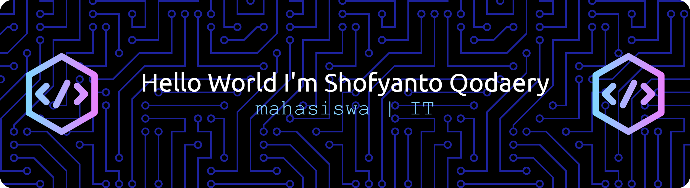

# Hello World I'm Shofyanto Qodaery 👋👋👋

### 🚀 Tech Enthusiast | Student Developer | System Architecture

I'm a university student in Indonesia with a strong passion for blending **software development, artificial intelligence, and engineering**. I love building solutions that matter—from designing system architectures to researching campus sustainability initiatives!

#

### 👨‍💻 About Me
- 🎓 Currently diving deep into **Software Architecture**, **Python**, and **AI Workflows**.
- 🌱 Actively exploring AI tools to optimize research and daily productivity.
- 🏗️ Building projects like **TutorHub** and analyzing Campus Zero-Waste systems.
- 🎨 Also a content creator blending tech and visual design.
- 💬 Ask me about: **Python, Git/GitHub, PlantUML, or Engineering concepts!**
- ⚡ Fun fact: I love turning complex logic gates and system architectures into clean, understandable diagrams.

#
### 🌟 Featured Projects

#### 📚 [TutorHub](#) <!-- Ganti # dengan link repositori TutorHub kamu -->
*A tutoring application platform designed to bridge the gap between students and educators.*
- **Focus:** System Architecture & Modeling
- **What I Did:** 
  - Designed the core system architecture for the platform.
  - Constructed detailed **Use Case** and **Sequence diagrams** to map out user interactions and system control flows.
- **Tech Stack:** `PlantUML`, `Software Architecture`

#
### 🛠️ Tech Stack & Tools

**Languages & Development:**

**Architecture, Modeling & Design:**

**Environment:**

#
### 📫 Let's Connect!
- **LinkedIn:** [linkedin.com/in/shofyanto](#) <!-- Masukkan link aslimu -->
- **Instagram:**  
- **Email:** [shoyantoqodar@gmail.com](mailto:emailmu@domain.com) <!-- Masukkan email aslimu -->